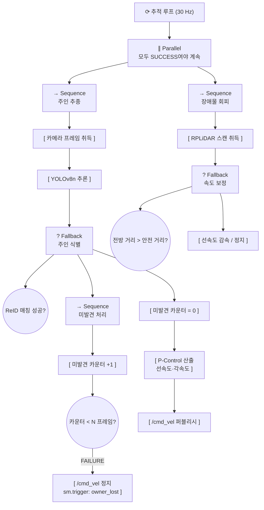
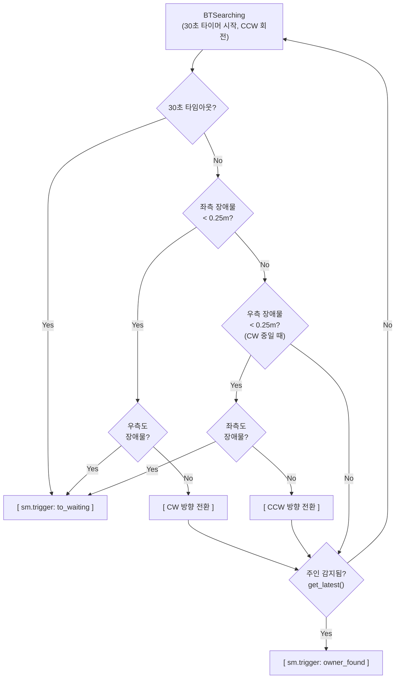
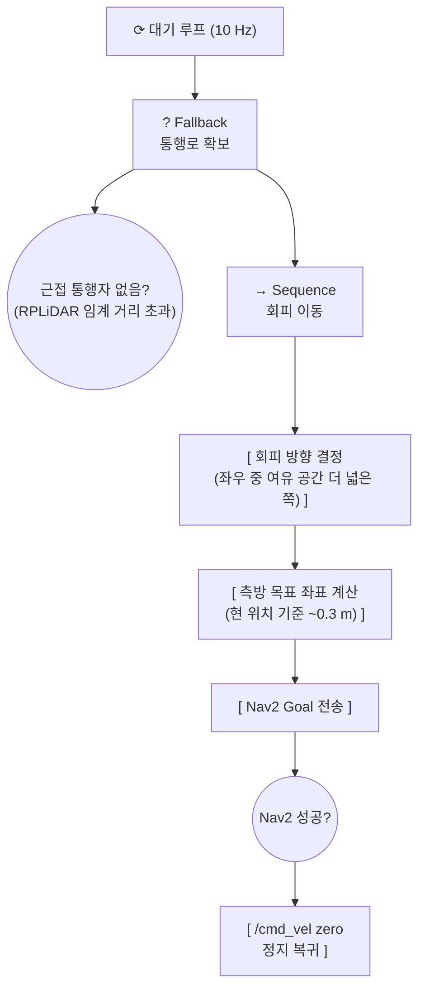
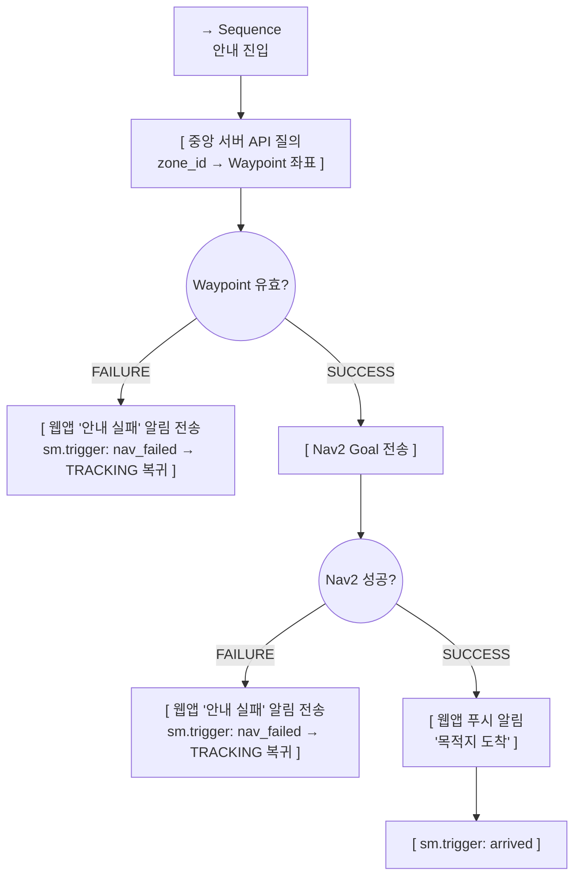
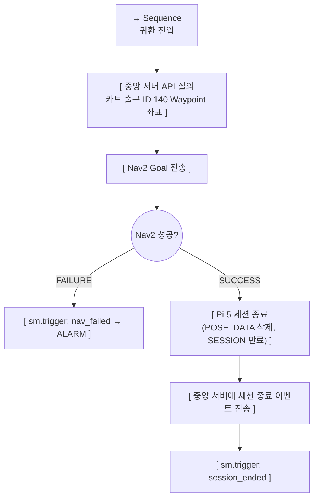

# 행동 트리 (Behavior Tree)

> **프로젝트:** 쑈삥끼 (ShopPinkki)
> **팀:** 삥끼랩 | 에드인에듀 자율주행 프로젝트 2팀

쑈삥끼의 **주행·네비게이션 세부 로직**을 Behavior Tree로 정의합니다.
상태 전환 판단은 State Machine(`docs/state_machine.md`)이 담당하며,
BT는 각 상태 안에서 "어떻게 움직일 것인가"만 책임집니다.

---

## SM ↔ BT 역할 분담

```
State Machine           Behavior Tree
──────────────          ──────────────────────────────
어떤 상태인가?    ←───→  그 상태에서 어떻게 움직이는가?
상태 전환 결정           주행·회피·탐색 세부 실행
이벤트 수신              주행 완료/실패 → SM에 이벤트 반환
```

- SM `on_enter_*` 콜백에서 해당 BT를 시작(tick loop)
- SM `on_exit_*` 콜백에서 BT 중단
- BT Action 노드가 `sm.trigger('event')` 호출로 전환을 유발

---

## BT 적용 범위

BT는 **주행·네비게이션 로직이 있는 상태**에만 적용합니다.

| 상태 | BT 적용 | 이유 |
|---|---|---|
| `IDLE` | 없음 | 정지 상태. LCD QR 표시만 수행 |
| `TRACKING` | BT 1 | P-Control 추종 + 장애물 회피 |
| `SEARCHING` | BT 2 | 제자리 회전 탐색 |
| `WAITING` | BT 3 | 통행자 회피 이동 |
| `ITEM_ADDING` | 없음 | 정지 상태. QR 스캔만 수행 (주행 없음) |
| `GUIDING` | BT 4 | Nav2 Waypoint 이동 |
| `RETURNING` | BT 5 | Nav2 귀환 이동 |
| `ALARM` | 없음 | 이동 정지. 직원 호출 대기만 수행 |

---

## 노드 표기

| 표기 | 종류 | 동작 |
|---|---|---|
| `→ Sequence` | 시퀀스 | 자식을 순서대로 실행. 하나라도 FAILURE → FAILURE |
| `? Fallback` | 폴백 | 자식을 순서대로 실행. 하나라도 SUCCESS → SUCCESS |
| `[ ]` | Action | 실제 동작 수행 |
| `(( ))` | Condition | 조건 검사만 수행, 사이드이펙트 없음 |

---

## BT 1: TRACKING

**목적:** 주인을 인식하고 P-Control로 추종. RPLiDAR 장애물 회피를 병렬 적용.
**연관 SR:** SR-21, SR-22, SR-30, SR-31



**설계 포인트**
- 미발견 카운터로 일시적 가림(occlusion)에 내성을 확보한다. N은 구현 시 확정.
- 장애물 회피는 P-Control 출력을 후처리로 보정하며, `/cmd_vel` 는 단일 퍼블리셔에서만 출력한다.

---

## BT 2: SEARCHING

**목적:** 30초간 제자리 회전하며 탐색. 재발견 시 TRACKING 복귀, 타임아웃/장애물 시 WAITING 전환.
**연관 SR:** SR-21, SR-22, SR-37



**설계 포인트**
- 스텝/각도 없이 시간 기반으로 단순화. `SEARCH_TIMEOUT = 30.0`초.
- 회전하면서 동시에 감지 확인 (정지-감지 반복 없음).
- RPLiDAR 좌/우 호(45°~135°, 225°~315°) 기준으로 장애물 체크.
- 장애물 감지 시 반대 방향으로 전환. 양측 모두 막히면 즉시 WAITING.

---

## BT 3: WAITING

**목적:** 정지 대기 중 근접 통행자를 감지하면 Nav2로 소폭 측방 이동하여 통행로를 확보한다.
**연관 SR:** SR-36



**설계 포인트**
- WAITING BT는 SM 이벤트(앱 명령, 타임아웃)로만 종료되며 자체적으로 상태 전환을 유발하지 않는다.
- Nav2 실패 시 해당 틱을 FAILURE 처리하고 다음 틱에 재시도한다.

---

## BT 4: GUIDING

**목적:** 중앙 서버에서 상품 구역 Waypoint를 조회하여 Nav2로 이동. 도착 후 앱 알림 전송 및 TRACKING 복귀.
**연관 SR:** SR-35, SR-80, SR-81b



**설계 포인트**
- SM은 앱으로부터 zone_id를 받아 GUIDING으로 진입한다. Waypoint 조회는 BT가 zone_id로 수행한다.
- Waypoint 조회 실패와 Nav2 실패 모두 `nav_failed`로 처리한다 → TRACKING 복귀 + 앱 알림.
- 구역 이탈 감지(ALARM 전환)는 BT가 아닌 SM의 `/pinky/pose` 구독 콜백에서 처리한다.

---

## BT 5: RETURNING

**목적:** 카트 출구(ID 140) Waypoint로 Nav2 복귀. 도착 후 세션 종료 및 IDLE 전환.
**연관 SR:** SR-35, SR-84, SR-17



**설계 포인트**
- 구역 이탈 감지는 SM의 `/pinky/pose` 구독 콜백에서 처리한다 (BT와 독립).

---

## BT-SM 이벤트 인터페이스 요약

| BT | SM trigger | 전환 결과 |
|---|---|---|
| TRACKING BT | `owner_lost` | TRACKING → SEARCHING |
| SEARCHING BT | `owner_found` | SEARCHING → TRACKING |
| SEARCHING BT | `to_waiting` | SEARCHING → WAITING (타임아웃 또는 양측 장애물) |
| WAITING BT | (없음 — SM 이벤트로만 종료) | — |
| GUIDING BT | `arrived` | GUIDING → TRACKING |
| GUIDING BT | `nav_failed` | GUIDING → TRACKING (앱 "안내 실패" 알림) |
| RETURNING BT | `session_ended` | RETURNING → IDLE |
| RETURNING BT | `nav_failed` | RETURNING → ALARM (직원 개입 필요) |
