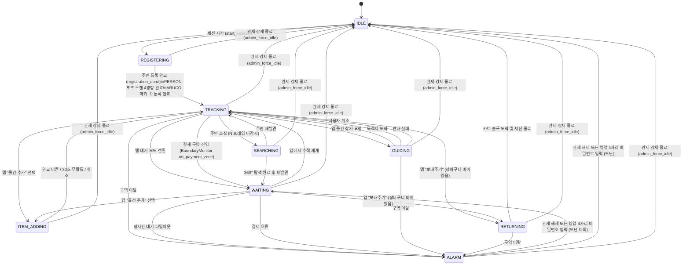

# 로봇 상태 머신 (State Machine)

> **프로젝트:** 쑈삥끼 (ShopPinkki)
> **팀:** 삥끼랩 | 에드인에듀 자율주행 프로젝트 2팀

쑈삥끼의 동작 모드 전환을 State Machine으로 정의합니다.
주행/회피 세부 로직은 별도 Behavior Tree(`docs/behavior_tree.md`)로 분리합니다.

---

## 상태 다이어그램



---

## 상태 정의

| 상태 | 설명 | LED | 진입 조건 |
|---|---|---|---|
| `IDLE` | 세션 없음. 카트 출구 도킹 대기. QR 코드 LCD 표시 | 파란색 | 최초 기동 / 귀환 완료 / 도난 알람 해제 후 초기화 |
| `REGISTERING` | 세션 시작됨. 주인 등록 중. PERSON: 4방향 포즈 스캔, ARUCO: 마커 ID 1회 등록 | 파란색 점멸 | `start_session` 명령 수신 (로그인 완료 후) |
| `TRACKING` | 주인 인식 및 P-Control 추종. PERSON: YOLOv8n+ReID, ARUCO: ArUco 마커 추종 | 초록색 | 주인 등록 완료 / 재발견 / 모드 복귀 |
| `SEARCHING` | 주인 소실 후 제자리 회전으로 재탐색 (SR-37) | 주황색 | TRACKING 중 N 프레임 연속 미감지 |
| `WAITING` | 추종 정지. 통행 방해 시 LiDAR로 자동 회피 (SR-36) | 파란색 | 재탐색 실패 / 앱 수동 전환 / 알람 해제(관제 대시보드 또는 웹앱 비밀번호 입력) |
| `ITEM_ADDING` | 추종 일시 정지, 카메라 QR 스캔 모드로 전환 (SR-42) | 하늘색 | 앱 "물건 추가" 선택 |
| `GUIDING` | Nav2 Waypoint로 진열대 이동 (SR-35) | 노란색 | 앱 물건 찾기 요청 |
| `RETURNING` | Nav2로 카트 출구(ID 140) 복귀 (SR-35, SR-84) | 보라색 | TRACKING 또는 WAITING에서 앱 "보내주기" (장바구니 비어있음) |
| `ALARM` | 직원 호출. 이동 정지. 관제 대시보드·LCD에 알람 표시. 관제 대시보드 해제 버튼 또는 현장 웹앱 4자리 비밀번호 입력으로 해제 | 빨간색 점멸 | 구역 이탈 / 배터리 부족 / 장시간 대기 / 결제 오류 |

---

## 전환 정의

| From | To | 트리거 | 조건 |
|---|---|---|---|
| `IDLE` | `REGISTERING` | `start_session` | `/robot_<id>/cmd` 수신: `{"cmd": "start_session", "user_id": "..."}` |
| `REGISTERING` | `TRACKING` | `registration_done` | PERSON: 4방향 포즈 스캔 완료 / ARUCO: 마커 ID 등록 완료 |
| `TRACKING` | `SEARCHING` | 주인 소실 감지 (`sm.trigger('owner_lost')` — BT) | N 프레임 연속 미감지 (N은 구현 시 확정) |
| `TRACKING` | `ITEM_ADDING` | 앱 명령 (`to_item_adding`) | WebSocket `{"cmd": "mode", "value": "ITEM_ADDING"}` |
| `WAITING` | `ITEM_ADDING` | 앱 명령 (`to_item_adding`) | WebSocket `{"cmd": "mode", "value": "ITEM_ADDING"}`. WAITING 중에도 물건 추가 가능 |
| `TRACKING` | `GUIDING` | 앱 명령 (`to_guiding`) ← **ARUCO 모드 전용** | `/robot_<id>/cmd`: `{"cmd": "navigate_to", "zone_id": <zone_id>}`. zone_id는 앱이 `find_product` 응답에서 수신한 값. Waypoint 조회는 BTGuiding이 진입 후 수행 |
| `TRACKING` | `WAITING` | 앱 명령 (`to_waiting`) | WebSocket `{"cmd": "mode", "value": "WAITING"}` |
| `TRACKING` | `RETURNING` | 앱 명령 (`to_returning`) | WebSocket `{"cmd": "mode", "value": "RETURNING"}` + 장바구니 비어있음 |
| `TRACKING` | `WAITING` | 결제 구역 진입 (`sm.trigger('to_waiting')` — BoundaryMonitor) | AMCL pose가 결제 구역(ID 150) 진입 감지. 로봇 정지 후 브라우저에 결제 UI 표시. 사용자가 [결제하기] 클릭 후 결제 처리. (SR-33, SR-34) |
| `TRACKING` | `ALARM` | 구역 이탈 감지 | AMCL pose가 shop_boundary 초과 (SR-32) |
| `WAITING` | `ALARM` | 결제 오류 (`sm.trigger('payment_error')`) | 결제 구역 진입 후 가상 결제 실패. control_service → `/robot_<id>/cmd`: `{"cmd": "payment_error"}` (SR-33, SR-34) |
| `SEARCHING` | `TRACKING` | 주인 재발견 (`sm.trigger('owner_found')` — BT) | YOLOv8n + ReID 매칭 성공 |
| `SEARCHING` | `WAITING` | 탐색 타임아웃 (`sm.trigger('to_waiting')` — BT) | 30초간 회전 탐색 후 미발견, 또는 양측 장애물로 회전 불가 |
| `WAITING` | `TRACKING` | 앱 명령 (`to_tracking`) | WebSocket `{"cmd": "mode", "value": "TRACKING"}` |
| `WAITING` | `RETURNING` | 앱 명령 (`to_returning`) | WebSocket `{"cmd": "mode", "value": "RETURNING"}` + 장바구니 비어있음 |
| `WAITING` | `ALARM` | 장시간 대기 타임아웃 | 대기 시작 후 일정 시간 경과 (시간은 구현 시 확정) |
| `ITEM_ADDING` | `TRACKING` | 완료 (`sm.trigger('qr_scanned')`) | 앱 "완료" 버튼 → `/robot_<id>/cmd`: `{"cmd": "confirm_item"}` |
| `ITEM_ADDING` | `TRACKING` | 무활동 타임아웃 (`sm.trigger('item_cancelled')`) | 마지막 스캔으로부터 30초 경과 |
| `ITEM_ADDING` | `TRACKING` | 취소 (`sm.trigger('item_cancelled')`) | 앱 "취소" → `/robot_<id>/cmd`: `{"cmd": "mode", "value": "TRACKING"}` |
| `GUIDING` | `TRACKING` | 목적지 도착 (`sm.trigger('arrived')` — BT) | Nav2 Goal 성공. 앱에 "도착" 알림 전송 |
| `GUIDING` | `TRACKING` | 안내 실패 (`sm.trigger('nav_failed')` — BT) | Nav2 Goal 실패. 앱에 "안내 실패" 알림 전송 |
| `GUIDING` | `TRACKING` | 사용자 취소 (`sm.trigger('to_tracking')`) | 앱 "취소" → Nav2 goal 취소 후 추종 복귀 |
| `GUIDING` | `ALARM` | 구역 이탈 감지 | AMCL pose가 shop_boundary 초과 (SR-32) |
| `RETURNING` | `IDLE` | 도착 및 세션 종료 (`sm.trigger('session_ended')` — BT) | Nav2 Goal 성공 + SESSION 종료 + POSE_DATA 삭제 |
| `RETURNING` | `ALARM` | 귀환 실패 (`sm.trigger('nav_failed')` — BT) | Nav2 Goal 실패. 로봇 고립으로 직원 개입 필요. ※ scenario_08 문서의 `nav_failed_return`은 오기 — `nav_failed`로 통일 |
| `RETURNING` | `ALARM` | 구역 이탈 감지 | AMCL pose가 shop_boundary 초과 (SR-32) |
| `ALARM` | `WAITING` | 알람 해제 | 배터리 / 장시간 대기 / 결제 오류 알람에 한해 해제. ① 관제 대시보드 해제 버튼 또는 ② 웹앱 4자리 비밀번호 입력(현장) |
| `ALARM` | `IDLE` | 알람 해제 | 도난(구역 이탈) 알람에 한해 해제. ① 관제 대시보드 해제 버튼 또는 ② 웹앱 4자리 비밀번호 입력(현장). 세션 강제 종료 및 초기화 |
| **모든 상태** | `ALARM` | 배터리 부족 | battery_level ≤ 임계값 (SR-90). IDLE·TRACKING·SEARCHING·WAITING·ITEM_ADDING·GUIDING·RETURNING 전부 해당. 다이어그램에는 가독성을 위해 생략. |
| **모든 상태** | `IDLE` | 관제 강제 종료 (`admin_force_idle`) | 관제자가 admin_app [강제 종료] 버튼 클릭 → `/robot_<id>/cmd: {"cmd": "force_terminate"}` → `terminate_session()` + `sm.trigger('admin_force_idle')`. 구현: `machine.add_transition('admin_force_idle', source='*', dest='IDLE')` |

---

## 구현 노트

### 라이브러리
- **`transitions`** — Python 상태 머신 라이브러리. 각 상태를 `states` 리스트로, 전환을 `add_transition()`으로 선언. `on_enter_*` / `on_exit_*` 콜백으로 ROS 2 퍼블리셔·서비스 호출을 연결.
- (주행/회피 세부 로직은 `py_trees`를 사용하는 별도 Behavior Tree로 구현 — `docs/behavior_tree.md` 참고)

### 구조
```
ShoppinkiStateMachine (transitions.Machine)
├── states: [IDLE, REGISTERING, TRACKING, SEARCHING, WAITING, ITEM_ADDING, GUIDING, RETURNING, ALARM]
├── initial: IDLE
├── transitions: (전환 정의 테이블 참고)
└── on_enter_* / on_exit_* 콜백으로 각 상태 진입·이탈 시 동작 정의
```

### ROS 토픽 연동
| 항목 | 방식 |
|---|---|
| 현재 상태 발행 | `on_enter_*` 콜백에서 `/pinky/mode` (`std_msgs/String`) 퍼블리시. control_service로의 전송은 `/robot_<id>/status` 루프(1~2Hz)가 담당. 알람은 `/robot_<id>/alarm` 즉시 발행 (SR-63) |
| 앱 모드 전환 명령 수신 | `/robot_<id>/cmd` 구독 콜백에서 JSON 파싱 후 `sm.trigger('to_tracking')` 등 직접 호출 |
| 세션 시작 수신 | `/robot_<id>/cmd` 구독 콜백: `{"cmd": "start_session", "user_id": "..."}` → `sm.trigger('start_session')` |
| 물건 위치 조회 (`find_product`) | 상태 전환 없음. control_service가 처리 후 결과를 customer_web → 브라우저로 전달. 앱에서 "안내받기" 선택 시 `navigate_to` 명령이 `/robot_<id>/cmd` 로 수신됨 |
| AMCL 구역 이탈 감지 | `/amcl_pose` 구독 콜백에서 경계 초과 시 `sm.trigger('zone_out')` 호출 |
| 배터리 잔량 감지 | pinkylib polling 콜백에서 임계값 이하 시 `sm.trigger('battery_low')` 호출 |
