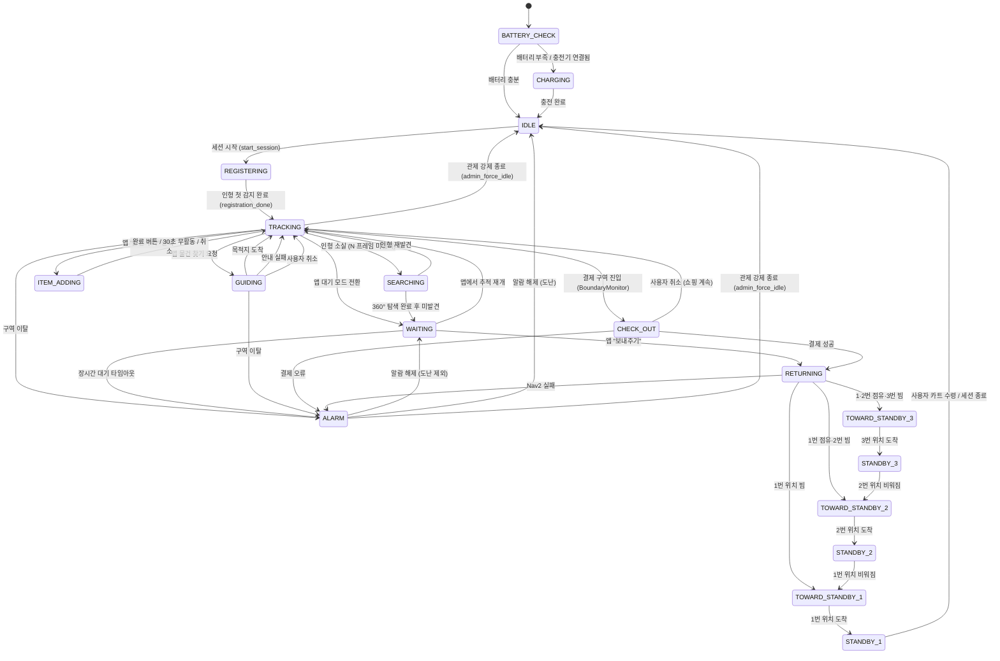

# 로봇 상태 머신 (State Machine)

> **프로젝트:** 쑈삥끼 (ShopPinkki)
> **팀:** 삥끼랩 | 에드인에듀 자율주행 프로젝트 2팀

쑈삥끼의 동작 모드 전환을 State Machine으로 정의합니다.
주행/회피 세부 로직은 별도 Behavior Tree(`docs/behavior_tree.md`)로 분리합니다.

---

## 상태 다이어그램



---

## 상태 정의

| 상태 | 설명 | LED | 진입 조건 |
|---|---|---|---|
| `BATTERY_CHECK` | 로봇 최초 기동 시 배터리 수준 확인 | — | 로봇 전원 ON |
| `CHARGING` | 충전기 연결 상태. 충전 완료 시 IDLE 전환 | 빨간색 (충전 중) → 파란색 (완료) | 배터리 부족 또는 충전기 연결 감지 |
| `IDLE` | 세션 없음. 카트 거치대 대기. QR 코드 LCD 표시 | 파란색 | 충전 완료 / 세션 종료 / 도난 알람 해제 후 초기화 |
| `REGISTERING` | 세션 시작됨. 커스텀 YOLO로 인형을 감지하고 ReID 특징 벡터 + 색상 히스토그램 등록 대기 | 파란색 점멸 | `start_session` 명령 수신 (로그인 완료 후) |
| `TRACKING` | YOLO로 인형 클래스 감지 후 ReID+색상 매칭으로 주인 인형 식별, P-Control 추종 | 초록색 | 인형 등록 완료 / 재발견 / 모드 복귀 |
| `SEARCHING` | 인형 소실 후 제자리 회전으로 재탐색 | 주황색 | TRACKING 중 N 프레임 연속 미감지 |
| `WAITING` | 추종 정지. 통행 방해 시 LiDAR로 자동 회피. RETURNING 순서 대기 포함 | 파란색 | 재탐색 실패 / 앱 수동 전환 / 알람 해제 |
| `ITEM_ADDING` | 추종 일시 정지, 카메라 QR 스캔 모드로 전환 | 하늘색 | 앱 "물건 추가" 선택 |
| `GUIDING` | Nav2 Waypoint로 진열대 이동 | 노란색 | 앱 물건 찾기 요청 |
| `CHECK_OUT` | 결제 구역 진입. 결제 진행 중. 성공 시 RETURNING, 실패 시 ALARM | 빨간색 | BoundaryMonitor 결제 구역(ID 150) 진입 감지 |
| `RETURNING` | Nav2로 카트 거치대 복귀. QueueManager에 대기열 위치 요청 | 보라색 | CHECK_OUT 결제 성공 / 앱 "보내주기" |
| `TOWARD_STANDBY_1` | 1번 대기 위치로 Nav2 이동 중 | 초록색 점멸 | 1번 위치 비어있음 (QueueManager 배정) |
| `STANDBY_1` | 1번 대기 위치에서 사용자 카트 수령 대기 | 초록색 | 1번 위치 도착 |
| `TOWARD_STANDBY_2` | 2번 대기 위치로 Nav2 이동 중 | 초록색 점멸 | 2번 위치 비어있고 1번 점유 / STANDBY_3에서 2번 비워짐 |
| `STANDBY_2` | 2번 대기 위치에서 대기 | 초록색 | 2번 위치 도착 |
| `TOWARD_STANDBY_3` | 3번 대기 위치로 Nav2 이동 중 | 초록색 점멸 | 1·2번 모두 점유 / STANDBY_2에서 앞 빈 상태 아님 |
| `STANDBY_3` | 3번 대기 위치에서 대기 | 초록색 | 3번 위치 도착 |
| `ALARM` | 직원 호출. 이동 정지. 관제 대시보드·LCD에 알람 표시. 해제는 대시보드 버튼 또는 현장 웹앱 4자리 비밀번호 입력 | 빨간색 점멸 | 구역 이탈 / 배터리 부족 / 장시간 대기 / 결제 오류 |

---

## 전환 정의

| From | To | 트리거 | 조건 |
|---|---|---|---|
| `BATTERY_CHECK` | `IDLE` | 배터리 OK | 배터리 ≥ 임계값 (`BATTERY_THRESHOLD`) |
| `BATTERY_CHECK` | `CHARGING` | 배터리 부족 | 배터리 < 임계값 또는 충전기 연결 감지 |
| `CHARGING` | `IDLE` | 충전 완료 | 배터리 100% 또는 충전기 분리 + 배터리 충분 |
| `IDLE` | `REGISTERING` | `start_session` | `/robot_<id>/cmd` 수신: `{"cmd": "start_session", "user_id": "..."}` |
| `REGISTERING` | `TRACKING` | `registration_done` | `doll_detector.is_ready() == True` (커스텀 YOLO로 인형 감지 + ReID/색상 등록 완료) |
| `TRACKING` | `SEARCHING` | 인형 소실 (`sm.trigger('owner_lost')` — BT) | N 프레임 연속 미감지 |
| `TRACKING` | `ITEM_ADDING` | 앱 명령 (`to_item_adding`) | `/robot_<id>/cmd`: `{"cmd": "mode", "value": "ITEM_ADDING"}` |
| `WAITING` | `ITEM_ADDING` | 앱 명령 (`to_item_adding`) | 동일. WAITING 중에도 물건 추가 가능 |
| `TRACKING` | `GUIDING` | 앱 명령 (`to_guiding`) | `/robot_<id>/cmd`: `{"cmd": "navigate_to", "zone_id": <zone_id>}` |
| `TRACKING` | `WAITING` | 앱 명령 (`to_waiting`) | `/robot_<id>/cmd`: `{"cmd": "mode", "value": "WAITING"}` |
| `TRACKING` | `CHECK_OUT` | 결제 구역 진입 (`sm.trigger('enter_checkout')` — BoundaryMonitor) | AMCL pose가 결제 구역(ID 150) 진입 감지. 브라우저에 결제 UI 표시 |
| `TRACKING` | `ALARM` | 구역 이탈 | AMCL pose가 shop_boundary 초과 |
| `SEARCHING` | `TRACKING` | 인형 재발견 (`sm.trigger('owner_found')` — BT) | 커스텀 YOLO 감지 성공 |
| `SEARCHING` | `WAITING` | 탐색 타임아웃 (`sm.trigger('to_waiting')` — BT) | 30초 회전 탐색 후 미발견 / 양측 장애물 |
| `WAITING` | `TRACKING` | 앱 명령 (`to_tracking`) | `/robot_<id>/cmd`: `{"cmd": "mode", "value": "TRACKING"}` |
| `WAITING` | `RETURNING` | 앱 명령 (`to_returning`) | `/robot_<id>/cmd`: `{"cmd": "mode", "value": "RETURNING"}` |
| `WAITING` | `ALARM` | 장시간 대기 타임아웃 | 대기 시작 후 `WAITING_TIMEOUT` 초 경과 |
| `ITEM_ADDING` | `TRACKING` | 완료 (`sm.trigger('item_done')`) | 앱 "완료" 버튼 → `/robot_<id>/cmd`: `{"cmd": "confirm_item"}` |
| `ITEM_ADDING` | `TRACKING` | 무활동 타임아웃 / 취소 (`sm.trigger('item_cancelled')`) | 마지막 스캔 후 30초 경과 또는 앱 "취소" |
| `GUIDING` | `TRACKING` | 목적지 도착 (`sm.trigger('arrived')` — BT) | Nav2 Goal 성공. 앱 "도착" 알림 전송 |
| `GUIDING` | `TRACKING` | 안내 실패 (`sm.trigger('nav_failed')` — BT) | Nav2 Goal 실패. 앱 "안내 실패" 알림 |
| `GUIDING` | `TRACKING` | 사용자 취소 (`sm.trigger('to_tracking')`) | 앱 "취소" → Nav2 goal 취소 후 추종 복귀 |
| `GUIDING` | `ALARM` | 구역 이탈 | AMCL pose가 shop_boundary 초과 |
| `CHECK_OUT` | `RETURNING` | 결제 성공 (`sm.trigger('payment_success')`) | 가상 결제 성공. control_service → Pi relay |
| `CHECK_OUT` | `TRACKING` | 사용자 취소 (`sm.trigger('to_tracking')`) | 앱 "쇼핑 계속" → 추종 복귀 |
| `CHECK_OUT` | `ALARM` | 결제 오류 (`sm.trigger('payment_error')`) | 가상 결제 실패. control_service → `/robot_<id>/cmd`: `{"cmd": "payment_error"}` |
| `RETURNING` | `TOWARD_STANDBY_1` | QueueManager 배정 | 1번 위치(zone 140) 비어있음 → Nav2 이동 시작 |
| `RETURNING` | `TOWARD_STANDBY_2` | QueueManager 배정 | 1번 점유 · 2번(zone 141) 비어있음 |
| `RETURNING` | `TOWARD_STANDBY_3` | QueueManager 배정 | 1·2번 모두 점유 · 3번 비어있음 |
| `RETURNING` | `ALARM` | Nav2 실패 (`sm.trigger('nav_failed')`) | 귀환 중 Nav2 Goal 실패. 직원 개입 필요 |
| `TOWARD_STANDBY_1` | `STANDBY_1` | 도착 (`sm.trigger('standby_arrived')`) | Nav2 Goal 성공 (zone 140) |
| `TOWARD_STANDBY_2` | `STANDBY_2` | 도착 (`sm.trigger('standby_arrived')`) | Nav2 Goal 성공 (zone 141) |
| `TOWARD_STANDBY_3` | `STANDBY_3` | 도착 (`sm.trigger('standby_arrived')`) | Nav2 Goal 성공 (zone 142) |
| `STANDBY_3` | `TOWARD_STANDBY_2` | 큐 전진 (`sm.trigger('queue_advance')`) | 앞 2번 위치 비워짐 (control_service QueueManager 신호) |
| `STANDBY_2` | `TOWARD_STANDBY_1` | 큐 전진 (`sm.trigger('queue_advance')`) | 앞 1번 위치 비워짐 (control_service QueueManager 신호) |
| `STANDBY_1` | `IDLE` | 세션 종료 (`sm.trigger('session_ended')`) | 사용자가 카트 수령 (QR 스캔 또는 타임아웃). SESSION 종료 |
| `ALARM` | `WAITING` | 알람 해제 (`sm.trigger('dismiss_to_waiting')`) | 배터리 / 대기 타임아웃 / 결제 오류 알람. ① 관제 대시보드 또는 ② 웹앱 4자리 PIN |
| `ALARM` | `IDLE` | 알람 해제 (`sm.trigger('dismiss_to_idle')`) | 도난(구역 이탈) 알람. 세션 강제 종료 및 초기화 |
| **모든 상태** | `ALARM` | 배터리 부족 (`battery_low`) | battery_level ≤ `BATTERY_THRESHOLD`. 다이어그램에는 가독성 위해 생략 |
| **모든 비IDLE 상태** | `IDLE` | 관제 강제 종료 (`admin_force_idle`) | 관제자 [강제 종료] → `/robot_<id>/cmd`: `{"cmd": "force_terminate"}` → `terminate_session()` + `sm.trigger('admin_force_idle')`. 구현: `machine.add_transition('admin_force_idle', source='*', dest='IDLE')` |

---

## 구현 노트

### 라이브러리
- **`transitions`** — Python 상태 머신 라이브러리. 각 상태를 `states` 리스트로, 전환을 `add_transition()`으로 선언. `on_enter_*` / `on_exit_*` 콜백으로 ROS 2 퍼블리셔·서비스 호출을 연결.
- (주행/회피 세부 로직은 `py_trees`를 사용하는 별도 Behavior Tree로 구현 — `docs/behavior_tree.md` 참고)

### 구조
```
ShoppinkiStateMachine (transitions.Machine)
├── states: [BATTERY_CHECK, CHARGING, IDLE, REGISTERING, TRACKING, SEARCHING,
│            WAITING, ITEM_ADDING, GUIDING, CHECK_OUT, RETURNING,
│            TOWARD_STANDBY_1, STANDBY_1,
│            TOWARD_STANDBY_2, STANDBY_2,
│            TOWARD_STANDBY_3, STANDBY_3,
│            ALARM]
├── initial: BATTERY_CHECK
├── transitions: (전환 정의 테이블 참고)
└── on_enter_* / on_exit_* 콜백으로 각 상태 진입·이탈 시 동작 정의
```

### ROS 토픽 연동

| 항목 | 방식 |
|---|---|
| 현재 상태 발행 | `on_enter_*` 콜백 → `/robot_<id>/status` 루프(1~2Hz)가 담당. 알람은 `/robot_<id>/alarm` 즉시 발행 |
| 앱 모드 전환 명령 수신 | `/robot_<id>/cmd` 구독 콜백에서 JSON 파싱 후 `sm.trigger(...)` 직접 호출 |
| 세션 시작 수신 | `{"cmd": "start_session", "user_id": "..."}` → `sm.trigger('start_session')` |
| 결제 구역 진입 | BoundaryMonitor `on_payment_zone` 콜백 → `sm.trigger('enter_checkout')` |
| AMCL 구역 이탈 감지 | `/amcl_pose` 구독 콜백 → 경계 초과 시 `sm.trigger('zone_out')` |
| 배터리 잔량 감지 | pinkylib polling 콜백 → 임계값 이하 시 `sm.trigger('battery_low')` |
| 큐 전진 신호 | control_service QueueManager → `/robot_<id>/cmd`: `{"cmd": "queue_advance"}` → `sm.trigger('queue_advance')` |

### CHECK_OUT vs WAITING (결제 흐름 비교)

> **이전:** TRACKING → WAITING (결제 구역 진입) → (결제 UI 표시) → RETURNING or ALARM
> **현재:** TRACKING → CHECK_OUT (결제 구역 진입) → RETURNING (성공) or ALARM (실패) or TRACKING (취소)

CHECK_OUT은 결제 전용 상태로 분리되어, WAITING 상태의 "일반 정지 대기"와 "결제 처리"를 명확히 구분한다.

### 대기열 (Standby Queue) 동작

1. RETURNING 진입 시 control_service QueueManager에 `/queue/assign?robot_id=<id>` 요청
2. QueueManager가 비어있는 가장 낮은 번호 위치 반환 (zone 140=1번, 141=2번, 142=3번)
3. SM이 해당 `TOWARD_STANDBY_X` 상태로 전환 → Nav2 이동
4. 앞 위치 비워지면 QueueManager가 `{"cmd": "queue_advance"}` 전송 → 앞 위치로 이동
5. STANDBY_1 도달 후 사용자가 카트 수령하면 SESSION 종료 → IDLE
