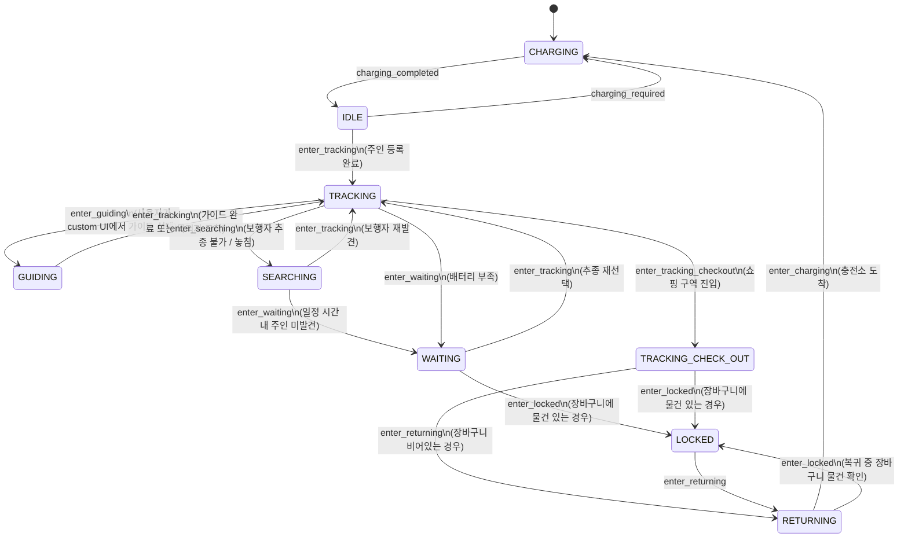

# 로봇 상태 머신 (State Machine)

> **프로젝트:** 쑈삥끼 (ShopPinkki)
> **팀:** 삥끼랩 | 에드인에듀 자율주행 프로젝트 2팀

쑈삥끼의 동작 모드 전환을 State Machine으로 정의합니다.
주행/회피 세부 로직은 별도 Behavior Tree(`docs/behavior_tree.md`)로 분리합니다.

---

## 상태 다이어그램



---

## 상태 정의

| 상태 | 설명 | 진입 조건 |
|---|---|---|
| `CHARGING` | 초기 상태. 충전기 연결 대기 또는 충전 중 | 로봇 전원 ON / 충전 필요 시 복귀 |
| `IDLE` | 사용자 등록 대기. 주인 인형 등록 기능 활성화 | 충전 완료 (`charging_completed`) |
| `TRACKING` | 주인 인형 팔로워 기능 활성화. 장바구니 물건 관리 기능 병행 | 주인 등록 완료 (`enter_tracking`) |
| `GUIDING` | 사용자 요청 목적지로 Nav2 이동 안내 | 고객 앱에서 가이드 선택 (`enter_guiding`) |
| `SEARCHING` | 주인 놓침. 제자리 회전으로 재탐색 | 추종 중 보행자 놓침 (`enter_searching`) |
| `WAITING` | 이동 정지. 배터리 부족 또는 탐색 타임아웃 | 배터리 부족 / 탐색 실패 (`enter_waiting`) |
| `TRACKING_CHECK_OUT` | 쇼핑 구역 진입 감지. 결제 흐름 진입 판단 | 결제 구역 진입 (`enter_tracking_checkout`) |
| `RETURNING` | Nav2로 충전소 복귀 중 | 결제 완료 / 장바구니 비어있음 (`enter_returning`) |
| `LOCKED` | 결제 완료 상태. 장바구니에 물건이 남아있음. 복귀 전 정산 대기 | 장바구니 물건 확인 (`enter_locked`) |

---

## 전환 정의

| From | To | 트리거 | 조건 |
|---|---|---|---|
| `[*]` | `CHARGING` | — | 로봇 전원 ON (초기 상태) |
| `CHARGING` | `IDLE` | `charging_completed` | 충전 완료 |
| `IDLE` | `CHARGING` | `charging_required` | 배터리 부족 감지 |
| `IDLE` | `TRACKING` | `enter_tracking` | 주인 인형 등록 완료 |
| `TRACKING` | `GUIDING` | `enter_guiding` | 고객이 custom UI에서 가이드(길 안내) 선택 |
| `GUIDING` | `TRACKING` | `enter_tracking` | 가이드 완료 또는 목적지 도착 |
| `TRACKING` | `SEARCHING` | `enter_searching` | 보행자 추종 불가 또는 주인 놓침 |
| `SEARCHING` | `TRACKING` | `enter_tracking` | 보행자(주인 인형) 재발견 |
| `SEARCHING` | `WAITING` | `enter_waiting` | 일정 시간 탐색 후 주인 미발견 |
| `TRACKING` | `WAITING` | `enter_waiting` | 배터리 부족 감지 |
| `WAITING` | `TRACKING` | `enter_tracking` | 고객이 추종 재개 선택 |
| `WAITING` | `LOCKED` | `enter_locked` | 장바구니에 물건이 있는 경우 |
| `TRACKING` | `TRACKING_CHECK_OUT` | `enter_tracking_checkout` | 쇼핑 구역(결제 구역) 진입 |
| `TRACKING_CHECK_OUT` | `RETURNING` | `enter_returning` | 장바구니가 비어있는 경우 (결제 없이 복귀) |
| `TRACKING_CHECK_OUT` | `LOCKED` | `enter_locked` | 장바구니에 물건이 있는 경우 (결제 처리) |
| `LOCKED` | `RETURNING` | `enter_returning` | 결제 완료 또는 정산 완료 후 복귀 |
| `RETURNING` | `CHARGING` | `enter_charging` | 충전소 도착 |
| `RETURNING` | `LOCKED` | `enter_locked` | 복귀 중 장바구니 물건 재확인 필요 |

---

## 구현 노트

### 라이브러리
- **`transitions`** — Python 상태 머신 라이브러리. 각 상태를 `states` 리스트로, 전환을 `add_transition()`으로 선언. `on_enter_*` / `on_exit_*` 콜백으로 ROS 2 퍼블리셔·서비스 호출을 연결.
- (주행/회피 세부 로직은 `py_trees`를 사용하는 별도 Behavior Tree로 구현 — `docs/behavior_tree.md` 참고)

### 구조
```
ShoppinkiStateMachine (transitions.Machine)
├── states: [CHARGING, IDLE, TRACKING, GUIDING, SEARCHING,
│            WAITING, TRACKING_CHECK_OUT, RETURNING, LOCKED]
├── initial: CHARGING
└── on_enter_* / on_exit_* 콜백으로 각 상태 진입·이탈 시 동작 정의
```

### ROS 토픽 연동

| 항목 | 방식 |
|---|---|
| 현재 상태 발행 | `on_enter_*` 콜백 → `/robot_<id>/status` 루프(1~2Hz)가 담당 |
| 앱 모드 전환 명령 수신 | `/robot_<id>/cmd` 구독 콜백에서 JSON 파싱 후 `sm.trigger(...)` 직접 호출 |
| 쇼핑 구역 진입 감지 | BoundaryMonitor `on_checkout_zone` 콜백 → `sm.trigger('enter_tracking_checkout')` |
| 배터리 잔량 감지 | pinkylib polling 콜백 → 임계값 이하 시 `sm.trigger('enter_waiting')` |
| 충전소 도착 감지 | Nav2 Goal 성공 (충전소 waypoint) → `sm.trigger('enter_charging')` |
