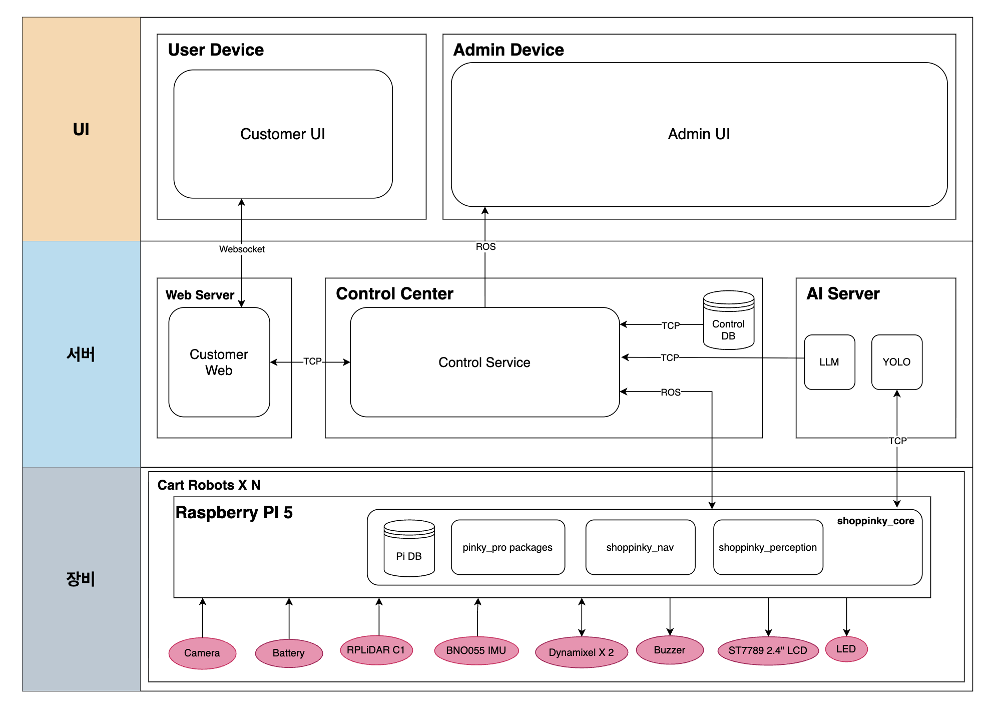

# 시스템 아키텍처 (System Architecture)

> **프로젝트:** 쑈삥끼 (ShopPinkki)

---

## 데모 모드

> 로봇이 작아 실제 맵에서 사람을 직접 인식하기 어렵기 때문에, **특정 인형을 대상으로 커스텀 학습된 YOLOv8 모델**로 추종한다.

| 항목 | 내용 |
|---|---|
| **로봇 위치** | 마트 바닥 (실제 맵 위에서 주행) |
| **추종 대상** | 전용 인형 (custom-trained YOLOv8) |
| **추종 방식** | 커스텀 YOLO 감지 결과 → P-Control (bbox 중심·크기 기반) |
| **ReID / 색상 매칭** | ✅ REGISTERING 시 인형 ReID 특징 벡터 + 색상 히스토그램 등록. TRACKING 시 YOLO 감지 후 ReID+색상으로 주인 인형 식별 |
| **Nav2 / AMCL / 맵** | ✅ (GUIDING / RETURNING / WAITING 회피에 사용) |
| **결제 구역 / 경계 감시** | ✅ (BoundaryMonitor via AMCL pose) |

---

## 전체 구성

---

## 컴포넌트 목록

| 컴포넌트 | 실행 위치 | 역할 |
|---|---|---|
| `shoppinkki_core` | Pi 5 | SM + BT 통합 노드. HW 제어(LED, LCD, 부저) |
| `shoppinkki_perception` | Pi 5 | 커스텀 YOLO 인형 감지 / QR 스캔 |
| `shoppinkki_nav` | Pi 5 | BTWaiting / BTGuiding / BTReturning / BoundaryMonitor |
| `pinky_pro packages` | Pi 5 | 모터 드라이버, 오도메트리, TF, LiDAR, 카메라 원시 데이터 |
| `Nav2 스택` | Pi 5 | AMCL 위치 추정, 경로 계획, `/scan` `/amcl_pose` 발행 |
| `control_service` | 서버 PC | ROS2 노드 + TCP(8080) + REST API. **Control DB 전체 관리** (SESSION/CART 포함) |
| `Control DB` | 서버 PC | SQLite. 모든 테이블 중앙 통합 (Pi 로컬 DB 제거) |
| `customer_web` | 서버 PC | Flask + SocketIO. 브라우저 ↔ control_service 중계. **LLM 직접 호출** |
| `Admin UI` | 서버 PC | TCP로 control_service에 연결하는 관제 앱 (별도 앱 존재 가정) |
| `yolo` (Docker) | 서버 PC | YOLOv8 추론 서버. **영상 UDP 수신 → 결과 TCP 반환** |
| `llm` (Docker) | 서버 PC | 자연어 상품 검색. customer_web REST 요청 처리 |

---

## 통신 채널

| 채널 | 연결 | 프로토콜 | 방향 | 설계 이유 |
|---|---|---|---|---|
| A | Customer UI ↔ customer_web | WebSocket (SocketIO) | 양방향 | 로봇 상태·위치를 새로고침 없이 실시간 Push |
| B | **Admin UI ↔ control_service** | **TCP** | 양방향 | 관리자 명령 유실 불허 → 신뢰성 최우선. 별도 기기에서 연결 |
| C | customer_web ↔ control_service | TCP (localhost:8080, JSON 개행 구분) | 양방향 | 기존과 동일 |
| D | **customer_web ↔ LLM** | **TCP (REST HTTP, :8000)** | 양방향 | 자연어 검색을 customer_web이 직접 처리 |
| E | **control_service ↔ Control DB** | **TCP** | 양방향 | DB가 독립 서비스로 분리 |
| F | **control_service ↔ YOLO** | **TCP + UDP 하이브리드** | 양방향 | 영상 데이터(무거움) → UDP / 인식 결과(좌표) → TCP |
| G | control_service ↔ shoppinkki packages | ROS 2 DDS (`ROS_DOMAIN_ID=14`) | 양방향 | 비즈니스 로직 명령·상태 발행/구독 |
| H | control_service ↔ pinky_pro packages | **ROS 2 + UDP** | 양방향 | 주행 명령 → ROS / 원시 카메라·센서 데이터 → UDP |

> 각 채널의 메시지 포맷 상세: [`docs/interface_specification.md`](interface_specification.md)

