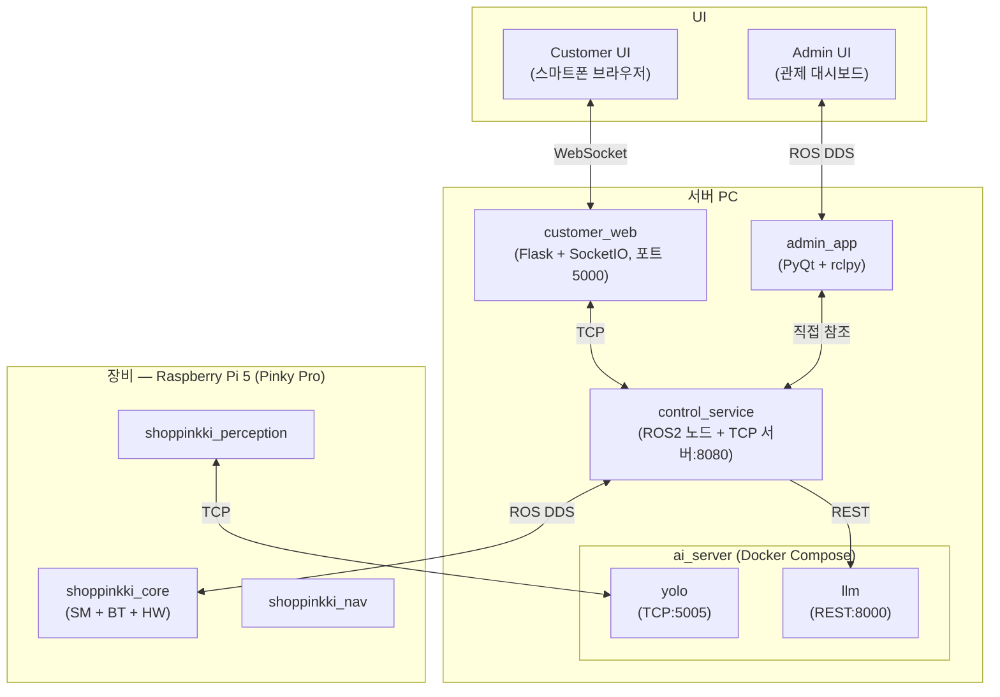

# 시스템 아키텍처 (System Architecture)

> **프로젝트:** 쑈삥끼 (ShopPinkki)

---

## 데모 모드

> 로봇이 작아 실제 맵에서 사람을 인식하기 어렵기 때문에 데모를 두 가지로 나눈다.

| | Demo 1 — PERSON | Demo 2 — ARUCO |
|---|---|---|
| **로봇 위치** | 책상 위 (카메라가 사람 높이) | 마트 바닥 |
| **추종 방식** | YOLO + ReID | ArUco 마커 인형 |
| **포즈 스캔** | ✅ | ❌ |
| **Nav2 / AMCL / 맵** | ❌ (P-Control만) | ✅ |
| **결제 구역 / 경계 감시** | ❌ | ✅ |
| **설정값** | `TRACKING_MODE = "PERSON"` | `TRACKING_MODE = "ARUCO"` |

---

## 전체 구성

---

## 컴포넌트 목록

| 컴포넌트 | 실행 위치 | 역할 |
|---|---|---|
| `shoppinkki_core` | Pi 5 | SM + BT 통합 노드. HW 제어(LED, LCD, 부저), Pi DB 관리 |
| `shoppinkki_perception` | Pi 5 (core import) | YOLO+ReID / ArUco 추종 / QR 스캔 / 포즈 스캔 |
| `shoppinkki_nav` | Pi 5 (core import) | BTWaiting / BTGuiding / BTReturning / BoundaryMonitor |
| `Nav2 스택` | Pi 5 | AMCL 위치 추정, 경로 계획, `/scan` `/amcl_pose` 발행 |
| `control_service` | 서버 PC | ROS2 노드 + TCP 서버(8080) + REST API. Control DB 관리 |
| `customer_web` | 서버 PC | Flask + SocketIO. 브라우저 ↔ control_service 중계 |
| `admin_app` | 서버 PC | PyQt + rclpy. 관제 대시보드 |
| `yolo` (Docker) | 서버 PC | YOLOv8 추론 서버. Pi 프레임 수신 → 결과 반환 |
| `llm` (Docker) | 서버 PC | 자연어 상품 검색. control_service REST 요청 처리 |

---

## 통신 채널

| 채널 | 연결 | 프로토콜 | 방향 |
|---|---|---|---|
| A | Customer UI ↔ customer_web | WebSocket (SocketIO) | 양방향 |
| B | customer_web ↔ control_service | TCP (localhost:8080, JSON 개행 구분) | 양방향 |
| C | Pi 5 ↔ control_service | ROS DDS (`ROS_DOMAIN_ID=14`) | 양방향 |
| D | admin_app ↔ control_service | 직접 참조 (동일 서버 PC 내, 별도 통신 없음) | 양방향 |
| E | shoppinkki_perception → yolo | TCP (서버PC:5005) | 양방향 |
| F | control_service → llm | REST HTTP (localhost:8000) | 단방향 |

> 각 채널의 메시지 포맷 상세: [`docs/interface_specification.md`](interface_specification.md)
